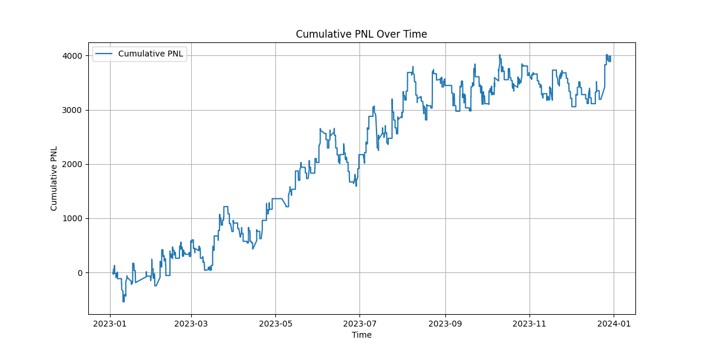
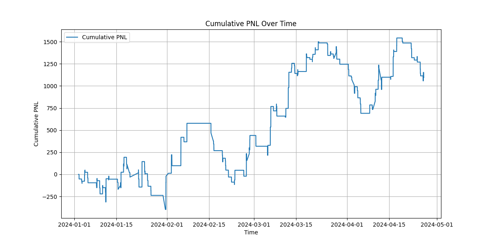

# Abstract
The core hypothesis of this strategy is that combining technical indicators (ATR, RSI, SMA) and momentum signal in VN30F1M data and VN30 data (since VN30 and VN30F1M is highly correlated) with dynamic position sizing can produce consistent, profitable trading signals. By scaling into positions based on volatility and signal strength, and applying robust risk controls (stop-losses, take-profits, partial exits, and trailing stops), the strategy aims to capture market opportunities while limiting downside risk.

# Introduction
In today's dynamic financial markets, systematic trading strategies require robust frameworks that adapt to changing conditions while effectively managing risk. This approach provides a comprehensive and systematic framework that bridges theoretical trading models with real-world applications, offering traders a disciplined method to navigate volatile markets while aiming for consistent performance.

# Strategy's Key Idea
- The investment capital allocated for trading derivatives in the Vietnamese market is 1.5 billion VND (45 contracts at a time)
- VN30F1M in these year is kind of a sideway market so reversion strategy with a reversal momentum indicator is my choice to aim for a strategy with big take profit

## Long position conditions: 

```
{
    def check_long_position_conditions(self, row, acceleration_threshold, quantity_multiply, sma_gap, short_acceleration_threshold, rsi_threshold):
        conditions = [
            row['Acceleration'] > acceleration_threshold,
            row['VN30 Acceleration'] > 0,
            row['volume'] > row['Average Quantity'] * quantity_multiply,
            row['Price/SMA'] < 1 - sma_gap,
            row['Short Acceleration'] > short_acceleration_threshold,
            row['RSI'] < 50 - rsi_threshold
        ] 
}
```
$$
\text{Acceleration} = \mathtt{matchedprice}\_t - \mathtt{matchedprice}_{t - momentumlookback}
$$

- **'Acceleration'**: Defined as the difference between the matched price at time 't' and the matched price at the previous momentum lookback interval. Positive acceleration indicates a genuine price reversal.

- **'Short Acceleration'**: Represents acceleration measured over the most recent intervals, verifying immediate past price momentum.

- **'VN30 Acceleration'**: VN30F1M is highly correlated with VN30 data so I also use VN30 data as a confirmation of the reversal signal

- **'Volume'**: The current trading volume per minute must exceed the historical average volume **'Average Quantity'** multiplied by a specified optimization factor **'quantity_multiply'**. Increased volume combined with price reversal signals supports entering a long position.

- **'Price/SMA Ratio'**: The current price relative to its Simple Moving Average (SMA) must be below a threshold (1 - sma_gap), signaling undervaluation.

- **'Relative Strength Index (RSI)'**: An RSI value lower than the threshold (50 - rsi_threshold) indicates an oversold condition, thus reinforcing the long position signal. An RSI below 20 strongly suggests an oversold market.

**Since the strategy is quite complex to matched all the signal, just 4 in 6 condition is needed to entry a position**

## Short Position Conditions:
Short positions are taken under conditions inverse to those for long positions, with a higher take-profit threshold.
Observationally, downward market trends typically show stronger momentum compared to upward trends, justifying a higher profit expectation from short positions.

## Position Sizing and Contract Management:
With a capital of 1.5 billion VND, the strategy can simultaneously trade up to 45 contracts. Thus, determining the strength of the trading signal is crucial for optimal contract allocation.

### Signal Strength Scoring:

- Signal strength is calculated as: Acceleration/Acceleration Threshold

- Higher values of 'a' suggest a stronger signal, prompting a larger number of contracts to be traded.

- The base number of contracts 'base_contract' is calculated by flooring the value of 'a' and multiplying by 10.

### Volatility Adjustment:

- During periods of high volatility (measured by the standard deviation of matched prices over the last 50 intervals, with each interval representing one minute), the number of contracts traded is reduced to 50% of the 'base_contract'.

- In low-volatility periods, contracts traded are increased to 150% of the 'base_contract'.

- Normal volatility periods warrant trading the exact 'base_contract' amount.

### Adjusted Entry Price:

When multiple orders are placed at different price levels, the entry price and total contracts are recalculated into a single average entry price to simplify strategy tracking and profit-and-loss (PnL) calculations:

$$
\text{Adjusted Entry Price} = \frac{Contracts_{t-1}.P_{t-1} + Contracts_t.P_t}{Contracts_{t-1} + Contracts_t}
$$


## Feature
- [x] Research the 1-minute candle scalping to beat the fee and spread (0.47 in total)
- [x] Validate Test Case: Momentum Signal, Reversion Signal and Backtesting
- [x] Optimize parameters
- [x] Evaluate backtesting and optimization
- [ ] Paper trade

---

## Installation

- Requirement: pip
- Install the dependencies by:
```
pip install -r requirements.txt
```
- Install ssi fast connect
```
cd data/fc-data.py
pip install -r requirements.txt
```

---

# Data

## Data Source

- Historical market data of this project from 01/2023 to 04/2024 including OHLC (Open, High, Low, Close) prices, trading volumes (from Algotrade database), and the VN30 index values (from SSI fast connect data API).
More detail of SSI API can be found [here](https://guide.ssi.com.vn/ssi-products/)
- Data is sourced from reliable financial providers and stored as CSV format in data folder.

## Database Environment

- Create ```.env``` file and enter your data source configuration with the format
```
HOST=<host or ip>
PORT=<port>
DATABASE=<database name>
USER=<username>
PASSWORD=<password>
```
- source the .env file by the command:
```
source .env
```
- If you don't create ```.env``` file then the code will use data in ```mock``` folder
- Change the name of the ```stat-example``` folder to ```stat``` or create a new one with the same structure
- By default the code is run with file mode. To specify the path of the data file:
  - Create ```mock``` folder
  - Download and extract the in-sample, out-sample data files and place it in this folder

# Implementation
Tick based data is really noise and hard to develop the larger take profit strategy so I convert to 1 minute candle data for less noise and enhance more technical analysis.
## Environment Setup and Replication Steps
1. **Clone the Repository:**
 ```
git clone https://github.com/algotrade-research/scalping-strategy.git
```
# In-sample Backtesting

The data from 01/01/2023 to 31/12/2023 

## Parameters
- Strategy parameters (e.g., SMA window length, momentum lookback, acceleration thresholds, etc.)
- Risk management settings (e.g., stop-loss, take-profit thresholds)
- Initial asset value (e.g., 10,000)

## Data
- **Input Data:** `data/insample.csv`
- **Data Period:** For example, January 2023 to December 2023

## In-sample Backtesting Result
The in-sample backtesting results are summarized in a performance table and visualized with a cumulative PNL chart.  

To see the results, run this command with the ```main.py``` file
```
python main.py
```

# Optimization

- **Number of Trials:** 10000 
- **Sampler Seed:** 42  
- **Study Direction:** Maximize cumulative PNL

**It can take 10-15 second per trial, which can make it 5-6 hours for an entire process. Becareful**

Run the optimization process by
```
python optimization.py
```
## Optimization Process / Methods / Library
- **Library:** [Optuna](https://optuna.org/)
- **Method:** Tree-structured Parzen Estimator (TPE) sampler
- **Process:** Multiple trials are conducted to evaluate various parameter combinations, selecting the best based on the objective function (maximizing cumulative PNL).

## Parameters to Optimize
- SMA window length  
- SMA gap  
- Momentum lookback  
- Acceleration thresholds (long and short)  
- Take-profit threshold  
- Cut-loss threshold  
- Quantity window  
- Quantity multiplier  
- Short extra profit  
- RSI window  
- RSI threshold

## Optimization Result
The results is stored in optimization/sma.db
The best parameters is stored in ```optimization/best_params.json``` file
```
{
    "sma_window_length": 25,
    "sma_gap": 0.02017081163304353,
    "momentum_lookback": 7,
    "acceleration_threshold": 0.27265410618834895,
    "short_acceleration_threshold": 0.08577163230799632,
    "take_profit_threshold": 4.9983573167104245,
    "cut_loss_threshold": 1.955171845695386,
    "quantity_window": 20,
    "quantity_multiply": 2,
    "short_extra_profit": 1.9352589805341556,
    "rsi_window": 38,
    "rsi_threshold": 39
}
```
**Cumulative PnL**



# Out-of-sample Backtesting

**Cumulative PnL**

 
 
To see the results, run this command with the ```main.py``` file
```
python main.py
```
# Conclusion

In conclusion, this scalping strategy tackles the challenge of high transaction costs (0.47%), showing strong results in in-sample testing but limited success out-of-sample. While not consistently profitable across all conditions, it still achieved a positive PnL and, more importantly, provided valuable insights. Through this process, I gained a deeper understanding of strategy design, risk management, and the complexities of trading in high-fee environments—paving the way for future improvements.

<center>

|           | Sharpe Ratio |   MMMD  | Win Rate | Total Long Trades | Total Short Trades |
|-----------|--------------|---------|----------|-------------------|--------------------|
| In-Sample |    0.109     |  10.65% |  40.96%  |       5959        |        6355        |
|Out-Sample |    0.132     |  8.09%  |  44.17%  |       1840        |        1455        |

</center>

# References

This project did not have References
---
